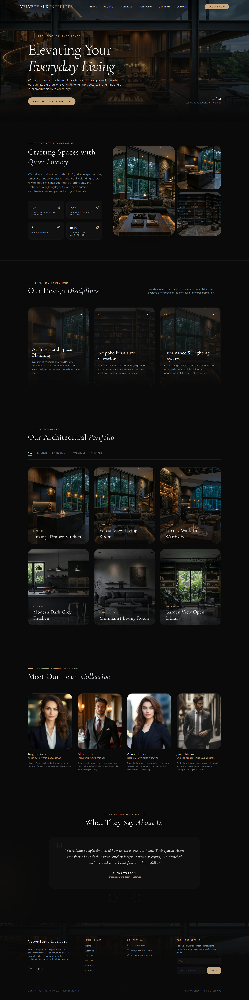

# Luxury Interior Design Portfolio Website - VelvetHaus Interiors

A modern luxury interior design website crafted with elegant UI/UX principles,
immersive visuals, smooth layouts, and responsive frontend architecture.

🌐 Live Demo: [[View Website](https://velvethaus.netlify.app/)]

## 📸 Application Screenshot

Click to Expand Screenshot

  

VelvetHaus Interiors is a premium frontend web experience designed for a luxury
architecture and interior design brand. The website focuses on visual storytelling,
minimalist elegance, and immersive portfolio presentation.

The project was built to demonstrate:
- Advanced responsive UI development
- Modern layout composition
- Luxury-themed typography and color systems
- Interactive user experience design
- Component-based frontend architecture

## 🛠 Tech Stack

- Frontend - React, Tailwind, React, Framer Motion
- UI & Styling - Flexbox, CSS Grid, Custom Animations, Responsive Design
- Fonts & Icons - Google Fonts, Lucid-react Icons 
